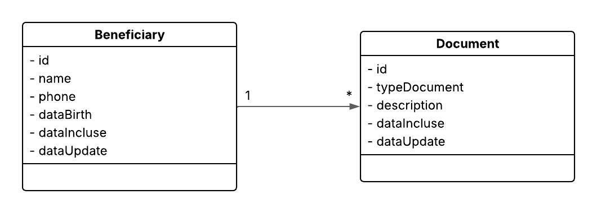

Aplicação Java e Spring Boot que fornece uma Api Rest para manter o cadastro de beneficiários de plano de Saúde.


# Requisitos do Desafio

Fornecer  uma Api Rest  com os seguintes funcionalidades:

- Cadastrar um Beneficiário com seus documentos
- Listar todos os Beneficiário cadastrados
- Listar todos os documentos de um Beneficiário
- Atualizar Dados Cadastrais de um Beneficiário
- Remover um Beneficiário

## Stack utilizada

- Java 17
- Spring Boot 3.5.4
- PostgreSQL 
- Docker
- Docker Compose

## 🚀 Como executar o projeto

> Pré-requisitos: Docker e Docker Compose instalados.

1. Clone este repositório:

Clone o projeto

```bash
  https://github.com/matheusandre1/health-plan-beneficiary
```

Entre no diretório do projeto
```bash
cd health-plan-beneficiary
```


Rode o Comando

```bash
docker-compose up -d 
```

Rode aplicação Java
```bash
mvn clean install
```

Link da Aplicação

```bash
http://localhost:8081/swagger-ui/index.html
```